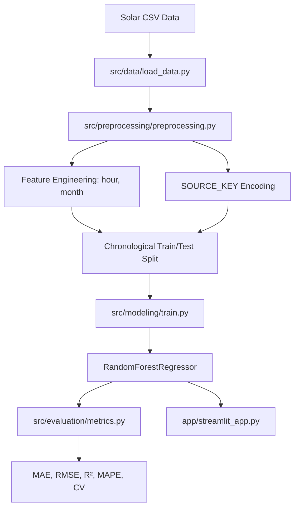
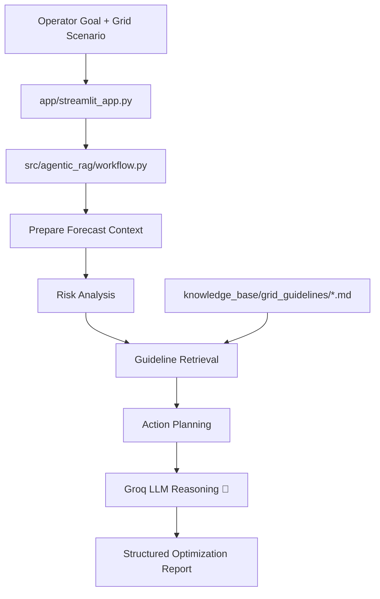
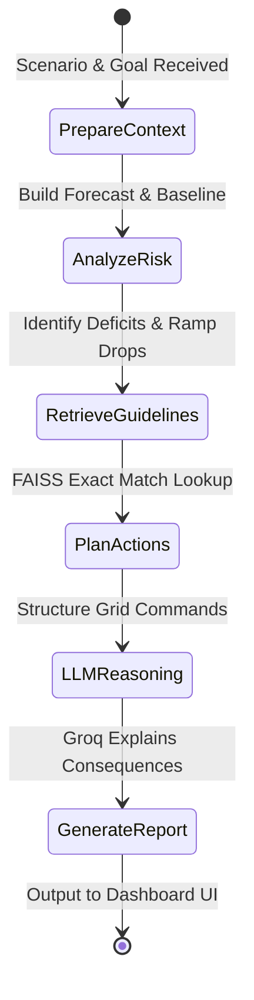

# Intelligent Solar Energy Forecasting and Agentic Grid Optimization

This project is a heavily integrated, enterprise-scale, two-milestone renewable energy decision support system:

- **Milestone 1:** Machine learning-based solar power forecasting
- **Milestone 2:** Agentic RAG-based grid optimization assistant and Native LLM Chatbot built on top of the forecast

The system predicts solar DC power generation from weather and temporal features, then uses an agentic retrieval workflow to analyze generation variability, retrieve grid-management guidance, and generate structured optimization recommendations. This entire pipeline is accessed via a single, unified, modern web application.

---

## 1. Problem Understanding and Renewable Context

The global energy sector is shifting from fossil fuels to renewable sources such as solar and wind. Solar power is clean and scalable, but it is also highly weather-dependent. Unlike conventional thermal plants, solar power cannot be dispatched on demand at will.

The core operational challenge is **variability**. A solar plant may produce strong output under clear skies, then suddenly lose generation because of cloud cover, thermal stress, or seasonal effects. Since grid stability depends on balancing supply and demand in real time, poor solar forecasting can lead to:

- voltage fluctuations
- reserve shortfalls
- unnecessary fossil backup activation
- poor battery scheduling
- underutilization of renewable energy

This project addresses that challenge comprehensively in two layers:

- **Predictive Layer (ML):** a supervised machine learning model accurately forecasts `DC_POWER`.
- **Cognitive Layer (Agentic & LLM):** an agentic LangGraph workflow reasons over forecast risks, retrieves best practices, provides "why" and "what if" insights utilizing the advanced Groq Llama 3.1 LLM, and produces actionable grid commands via a native chat interface.

---

## 2. Input Output Specification

### Forecasting Output

| Output Variable | Data Type | Unit | Description |
|---|---|---|---|
| `DC_POWER` | Continuous float | Watts (W) | Direct current power generated by a solar inverter |

### Forecasting Inputs

| Input Variable | Data Type | Unit / Range | Rationale |
|---|---|---|---|
| `IRRADIATION` | Continuous float | kW/m² | Most important driver of panel output |
| `MODULE_TEMPERATURE` | Continuous float | °C | Captures thermal efficiency loss at high panel temperature |
| `AMBIENT_TEMPERATURE` | Continuous float | °C | Influences cooling and operating conditions |
| `SOURCE_KEY` | Encoded categorical | Integer ID | Distinguishes inverter-specific behavior |
| `hour` | Integer | 0–23 | Captures daily solar curve |
| `month` | Integer | 1–12 | Captures seasonality |

### Agentic RAG Inputs

Milestone 2 extends the ML predictions by accepting scenario and grid-operation parameters from the operator:

- Operator goal or optimization question
- Forecast horizon
- Expected grid demand in kW
- Reserve margin percentage
- Critical load share
- Battery capacity, power limit, and state of charge

### Agentic RAG Outputs

The AI pipeline generates:

- Solar generation summary metrics
- Risk windows for deficit, surplus, ramp-down, and variability
- Structured grid balancing recommendations
- Battery charging/discharging suggestions
- Load-shifting and energy utilization strategies
- Supporting references from the local knowledge base
- Responsible AI notes

---

## 3. Comprehensive System Architecture & Flowcharts

### Milestone 1: ML Forecasting Pipeline



### Milestone 2: Agentic Optimization Workflow



### LangGraph Logic (Agent State Flow)



### Flow Breakdown

**Phase 1: ML Model Training & Setup**
1. Historical solar and weather data is loaded from CSV.
2. Features are prepared through time feature extraction and inverter encoding.
3. Data is split chronologically to prevent future leakage.
4. A `RandomForestRegressor` is trained and evaluated.

**Phase 2: Agentic Execution**
1. In the Streamlit app, the operator inputs variables through the unified glassmorphic UI.
2. The LangGraph agent generates a short period forecast utilizing the trained ML model.
3. The engine analyzes deficit risk, variability, surplus windows, and ramp-down events.
4. It contextually retrieves grid-management guidance from localized markdown knowledge bases.
5. The **Groq LLM** reviews the plans, injecting profound reasoning regarding consequence failure and impact.
6. Results are populated in a comprehensive dashboard supported by an Interactive AI Chatbot.

---

## 4. Milestone 1: ML Pipeline Implementation

### Under the Hood

- **Algorithm:** `RandomForestRegressor` — chosen over Neural Networks due to its incredible performance on non-linear tabular datasets and computational speed without GPUs.
- **Training style:** chronological 80/20 split
- **Validation:** holdout metrics + `TimeSeriesSplit` cross-validation

**Core scripts:**
- `src/data/load_data.py`
- `src/preprocessing/preprocessing.py`
- `src/modeling/train.py`
- `src/evaluation/metrics.py`

### Feature Dashboard Overview

The ML unified dashboard includes:

- **Predict tab** — Evaluate singular predictions or process batched CSVs.
- **Data Analysis tab** — Discover seasonal and hourly nuances via robust EDA plotting.
- **Model Evaluation tab** — Holdout metrics, actual vs predicted density plots, residual analysis, feature importance (Tree estimators).
- **Forecast tab** — Short-term horizon simulation curves.
- **Logs and Export tab** — Detailed execution logs & downloadable outputs.

---

## 5. Milestone 2: Generative AI & Agentic Implementation

We extended the predictive model using explicitly robust integrations with Agentic Frameworks and Large Language Models, entirely unified inside the primary application.

### Major Integration Features
- **Ask AI Native Chatbot:** Replacing legacy chat-boxes, the application utilizes `st.chat_message` functionality to provide an uninterrupted conversational interface over your output report.
- **Groq API & Llama-3.1-8b Integration:** By using Groq's low-latency LPUs, logic resolution logic takes less than a fraction of a second.
- **Secret Management:** Hardcoded configs have been swapped for enterprise-standard `.env` workflows (`python-dotenv`).

### Agentic Workflow Components

| Component | Purpose |
|---|---|
| `forecast_bridge.py` | Bridges ML dependencies to Gen AI context. |
| `risk_engine.py` | Performs pure mathematical risk evaluation on generation deficits. |
| `retrieval.py` | Unearths targeted grid policies locally via vector / tf-idf logic. |
| `prompting.py` | Standardizes synthesis instructions. |
| `reporting.py` | Markdown compiler. |
| `workflow.py` | Builds the LangGraph State machine including the new `_llm_reason` node setup. |
| `state.py` | Explicit TypeDict containing history, guidelines, logic loops, and `llm_reasoning` markers. |

### RAG Knowledge Base

The system relies on localized, grounded, Markdown guidelines preventing LLM Hallucinations:
- solar variability management
- battery dispatch strategy
- load shifting and demand response
- grid balancing reserves
- renewable utilization

---

## 6. How to Run Locally

### 1. Environment & Installations

1. Open your terminal and create a virtual environment:
   ```bash
   python3 -m venv venv
   source venv/bin/activate
   ```
2. Install all required dependencies (ML + LLM Stack):
   ```bash
   pip install -r requirements.txt
   pip install -r requirements_agentic_rag.txt
   ```

### 2. Configure Groq API (.env)
Create a `.env` file in the root folder of the project to securely house your LLM API limits (this file is ignored via `.gitignore`).
```bash
GROQ_API_KEY=gsk_your_private_groq_api_key_here
```

### 3. Execution
Since the dashboard has been **unified**, both forecasting and AI optimization live under the same hood.
```bash
streamlit run app/streamlit_app.py
```
*Navigate to the far-right tab named **"AI Grid Optimizer"** to experience the agentic application.*

---

## 7. Performance & Evaluation Metrics

The forecasting engine demonstrates incredible predictive fidelity against real-world plant scaling:

| Metric | Holdout Score |
|---|---|
| R² | 0.9296 |
| MAE | 460.65 W |
| RMSE | 933.25 W |
| MAPE | 110.65% |

### Interpretation

- **R² = 0.9296** shows that approximately 93% of the variation in solar output is confidently learned and mapped by the RandomForest.
- **MAE = 460.65 W** indicates an extremely low absolute error margin relatively compared to total solar outputs.
- **MAPE is high** solely because power generation hovers at exactly `0` during early mornings/nights, thereby inflating any percentage metric drastically.

### Cross Validation Stability
Time-series CV with k=5:

| Metric | Mean | Std Dev |
|---|---|---|
| R² | 0.8096 | ± 0.0909 |
| MAE | 744.68 W | ± 268.68 |

---

## 8. Final Output & Chat Structure

The AI pipeline structures the final Markdown output report intelligently encompassing:
- Operator Executive Summary
- Solar Output Deficit Markers
- Categorized Technical Adjustments (Ramps, Baselines, Flex loads)
- `🧠 AI Reasoning`: Why the system generated exactly these recommendations.

Using the **Native Chat Interface**, operators can subsequently query:
> *"If I reduce the reserve margin from 20% to 5%, what immediate physical actions must I take?"* <br/>
> The AI dynamically parses the prompt in the context of the underlying ML models and gives real-world engineering constraints over standard Chat outputs.

---

## 9. Codebase Tree Structure

```
Solar-power-forecasting-ml/
├── app/
│   └── streamlit_app.py            # Fully Unified Presentation Application
├── data/
│   └── processed/solar_final.csv   
├── docs/
│   └── agentic_rag_workflow.md
├── knowledge_base/
│   └── grid_guidelines/            # Grounded Policy Source Documentation 
├── src/
│   ├── data/
│   ├── preprocessing/
│   ├── modeling/
│   ├── evaluation/
│   └── agentic_rag/                # Core Agent Logic + LangGraph States
├── tests/
│   ├── test_agentic_rag_retrieval.py
│   └── test_agentic_rag_risk_engine.py
├── .env                            # Secure Runtime Keys
├── training_log.json
├── requirements.txt
└── requirements_agentic_rag.txt
```

---

## 10. Validation Testing Suite

Rigorous sanity testing scripts allow development to proceed safely:
```bash
python3 -m pytest tests/test_agentic_rag_risk_engine.py tests/test_agentic_rag_retrieval.py -q
```

---

## 11. Important Notes

- **One Ecosystem:** The pipeline previously maintained isolated applications. They have now been securely merged into `streamlit_app.py` maximizing data throughput across features.
- If `models/solar_model.pkl` is missing, the Agentic RAG layer can securely trigger an in-memory chronological fallback training phase guaranteeing app functionality.
- The repository perfectly caters to Git Security expectations by omitting hardcoded deployment secrets.

---

## 12. Conclusion

This project seamlessly links robust **Supervised ML** forecasting with cutting edge **Agentic Generative AI**.

It actively pivots a standard analytics dashboard into a dedicated **Decision Support System**. By tracking state, injecting Groq LLM logic, managing grid variables, and implementing a native AI chatbot directly upon the reporting structure, operators achieve not just insight on *what* will happen, but proactive automated instructions on exactly *what to do* about it.
