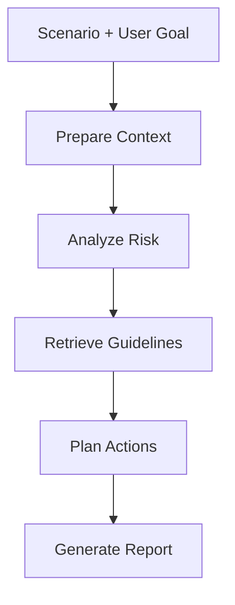

# Agentic RAG Workflow Documentation

Milestone 2 is implemented as an additive layer so the existing Milestone 1 forecasting code remains untouched.

## Workflow

1. Build a short-horizon solar forecast from the Milestone 1 model.
2. Analyze variability, deficit, surplus, and ramp-down risk windows.
3. Retrieve grid-management guideline chunks from the local knowledge base.
4. Generate structured balancing, storage, and utilization recommendations.
5. Render a structured optimization report with references and responsible-AI notes.

## State Graph



## Files Added

- `app/streamlit_app.py` (updated to include AI Grid Optimizer tab)
- `src/agentic_rag/`
- `knowledge_base/grid_guidelines/`

## Run Instructions

```bash
pip install -r requirements.txt
pip install -r requirements_agentic_rag.txt
export GROQ_API_KEY="your_api_key_here"
streamlit run app/streamlit_app.py
```

If `langgraph` is unavailable, the code still executes the same node order through a deterministic fallback so the demo remains runnable.
